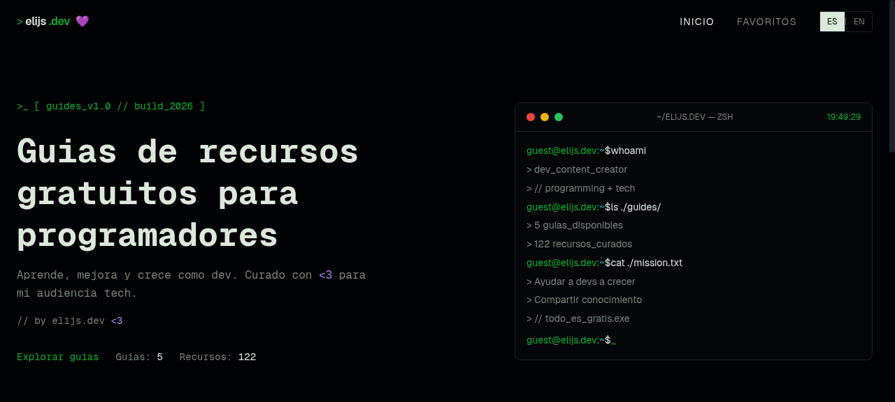

<div align="center">

# >_ elijs.dev 💜

### Guías de Recursos Gratuitos para Programadores

Aprende, mejora y crece como dev. Recursos creados con amor para la comunidad tech.

[](https://nextjs.org/)
[](https://react.dev/)
[](https://tailwindcss.com/)
[](https://www.typescriptlang.org/)
[](https://vercel.com/)

[🌐 Ver sitio en vivo](https://recursos.elijs.dev/) · [🐛 Reportar bug](../../issues) · [✨ Sugerir recurso](../../issues)

</div>

---

## 📸 Preview

<div align="center">
  
</div>

---

## 🎯 ¿Qué es esto?

Una plataforma web open source que recopila **guías curadas de recursos gratuitos** para programadores de todos los niveles. Desde juegos para aprender a programar hasta guías avanzadas de optimización web y preparación de portafolios.

```bash
guest@elijs.dev:~$ ls ./guides/
> 12 guías_disponibles
> 150+ recursos_creados
> // todo_es_gratis.exe
```

---

## 📚 Guías Disponibles

| # | Guía | Descripción |
|---|------|-------------|
| 🎮 | **Aprende a Programar Jugando** | Plataformas para dominar lenguajes mientras te diviertes |
| 🚀 | **Mejorar en Programación 2026** | Diseñar soluciones y resolver problemas complejos |
| 📚 | **Recursos Gratuitos 2026** | Plataformas y cursos para ser Frontend, Backend o Fullstack |
| ⚛️ | **Proyecto Frontend con React** | Construir un proyecto React conectado con Google Sheets |
| ⚡ | **Optimización Web** | Optimizar la experiencia del usuario y el SEO |
| 💼 | **Recursos para tu Portafolio** | Proyectos prácticos para un portafolio profesional |
| 📄 | **CV, Portafolio y GitHub** | Planificar tu carrera y preparar entrevistas |
| 🏅 | **Certificaciones para tu CV** | Certificaciones gratuitas de Google, IBM, Microsoft |
| 🔌 | **Trabajar con APIs** | Diseño, consumo y deploy de APIs profesionales |
| 🎯 | **Entrevistas Técnicas como en Google** | Recursos para entrenar entrevistas técnicas con feedback real |
| 🧠 | **Lógica y Práctica (30 días)** | Ejercicios para mejorar tu pensamiento algorítmico |
| 🚀 | **Aprender como Senior** | Consejos para crecer como desarrollador senior |

---

## ✨ Features

- 🌍 **Bilingüe** — Español e Inglés con switch instantáneo
- 🔍 **Búsqueda** — Filtra guías y recursos en tiempo real
- ⭐ **Favoritos** — Guarda tus recursos preferidos (localStorage)
- 🌙 **Dark/Light mode** — Tema oscuro por defecto con estética terminal
- 📱 **Responsive** — Diseño adaptado a móvil, tablet y desktop
- 🖥️ **Terminal UI** — Interfaz inspirada en terminal con animaciones
- ⚡ **Rápido** — Next.js 16 con App Router y React 19

---

## 🛠️ Tech Stack

| Categoría | Tecnología |
|-----------|-----------|
| Framework | Next.js 16 (App Router) |
| UI Library | React 19 |
| Lenguaje | TypeScript 5.7 |
| Estilos | Tailwind CSS 4 |
| Componentes | Radix UI + shadcn/ui |
| Iconos | Lucide React |
| Fuentes | Geist Sans & Geist Mono |
| Deploy | Vercel |
| Analytics | Vercel Analytics |

---

## 🚀 Instalación Local

```bash
# Clonar el repositorio
git clone https://github.com/elizabthpazp/guias-recursos-gratuitos.git
cd guias-recursos-gratuitos

# Instalar dependencias
pnpm install
# o
npm install

# Iniciar servidor de desarrollo
pnpm dev
# o
npm run dev
```

Abre [http://localhost:3000](http://localhost:3000) en tu navegador.

---

## 📁 Estructura del Proyecto

```
guias-recursos-gratuitos/
├── app/                    # App Router (páginas)
│   ├── page.tsx            # Home
│   ├── layout.tsx          # Layout principal
│   ├── guides/[slug]/      # Páginas dinámicas de guías
│   └── favorites/          # Página de favoritos
├── components/             # Componentes React
│   ├── home-content.tsx    # Contenido principal
│   ├── guide-card.tsx      # Tarjeta de guía
│   ├── resource-card.tsx   # Tarjeta de recurso
│   ├── terminal-window.tsx # Terminal animada
│   ├── navbar.tsx          # Navegación
│   └── ui/                 # Componentes base (shadcn)
├── lib/                    # Utilidades y datos
│   ├── guides-data.ts      # Datos de todas las guías
│   ├── i18n.ts             # Traducciones ES/EN
│   ├── favorites.ts        # Lógica de favoritos
│   └── locale-context.tsx  # Contexto de idioma
└── public/                 # Assets estáticos
```

---

## 🤝 Contribuir

¡Las contribuciones son bienvenidas! Si quieres agregar un recurso o mejorar algo:

1. Haz fork del repositorio
2. Crea una rama (`git checkout -b feature/nuevo-recurso`)
3. Agrega tu recurso en `lib/guides-data.ts`
4. Commit (`git commit -m 'feat: agregar recurso X'`)
5. Push (`git push origin feature/nuevo-recurso`)
6. Abre un Pull Request

### Agregar un nuevo recurso

Los recursos se encuentran en `lib/guides-data.ts`. Cada recurso tiene esta estructura:

```typescript
{
  id: 'mi-recurso',
  name: 'Nombre del Recurso',
  description: 'Descripción breve del recurso.',
  url: 'https://ejemplo.com/',
}
```

---

## 📝 Licencia

Este proyecto es open source y está disponible para la comunidad.

---

<div align="center">

Hecho con 💜 por [elijs.dev](https://www.elijs.dev/)

**¿Te fue útil? Dale una ⭐ al repo**

</div>
